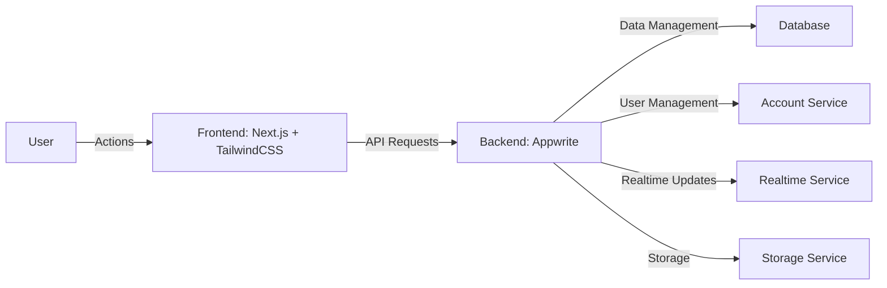

<!-- logo -->

  

<!-- title -->
<h1 align="center" style="display:flex;justify-content:center;align-items:center;width:100%;gap:10px;padding:10px 0;margin-bottom:20px;border-bottom:1px solid #4a4f57">
    The Nonprofit Portal
    
</h1>
<!-- powered by -->

  
  

<!-- brief description -->

  
  
    
  
  
The Nonprofit Portal - a comprehensive platform dedicated to empowering nonprofit organizations! 👥

<h2 style="display:flex;align-items:center;gap:10px;padding:10px 0;margin-bottom:20px;border-bottom:1px solid #4a4f57">
  
  Quick overview
</h2>

Every day, countless nonprofit organizations work tirelessly to bring about positive change in our communities. But often, the lack of efficient tools for managing their activities slows down their momentum. We noticed this gap and took it as an opportunity to contribute.

The Nonprofit Portal is a comprehensive web-based platform designed specifically for small to medium-sized nonprofits, their donors, and volunteers. Our mission? To streamline operations, foster transparency, and improve engagement within the nonprofit sector.

  <a href="https://thenonprofitportal.org">Website</a> •
  <a href="https://github.com/The-Nonprofit-Portal/legal/blob/main/LICENSE">License</a> •
  <a href="CONTRIBUTING.md">Contributing</a>

&nbsp;

<h2 style="display:flex;align-items:center;gap:10px;padding:10px 0;margin-bottom:20px;border-bottom:1px solid #4a4f57">
  
  High Level Architecture
</h2>

<h2 style="display:flex;align-items:center;gap:10px;padding:10px 0;margin-bottom:20px;border-bottom:1px solid #4a4f57">
  
  Features
</h2>

Since this is an ongoing project, there are some features that are actively on development. Below are marked the ones that are currently supported. Stay tuned for upcoming ones!

<h3 align="center">✨ ✨ ✨</h3>

- [ ] 🔐 **User Registration and Management**: Our platform supports role-based access, catering to admins, donors, and volunteers, each with customized dashboards to meet their specific needs.

- [ ] 💫 **Donation Tracking System**: Now donors can keep track of their contributions, and nonprofits can manage and acknowledge these donations efficiently.

- [ ] 🎗️ **Fundraising Campaign Management**: Launch, manage, and monitor fundraising campaigns, providing real-time updates to donors and volunteers.

- [ ] 📈 **Reporting and Analytics**: Gain insights into the organization's operations, donations, and campaigns with our easy-to-understand analytics dashboard.

- [ ] 🏦 **Payment Gateway Integration**: We've partnered with trusted services like Stripe and PayPal to facilitate secure financial transactions.

<h2 style="display:flex;align-items:center;gap:10px;padding:10px 0;margin-bottom:20px;border-bottom:1px solid #4a4f57">
  
  Author
</h2>

**Alain Iglesias**

- Website: https://aiherrera.com
- Blog: https://blog.aiherrera.com
- Twitter: [@\_aiherrera](https://twitter.com/_aiherrera)
- Github: [@aiherrera](https://github.com/aiherrera)
- LinkedIn: [@-aiherrera](https://linkedin.com/in/-aiherrera)

<h2 style="display:flex;align-items:center;gap:10px;padding:10px 0;margin-bottom:20px;border-bottom:1px solid #4a4f57">
  
  Contribute
</h2>

Contributions, issues and feature requests are welcome! Feel free to check [issues page](https://github.com/The-Nonprofit-Portal/thenonprofitportal.org/issues). You can also take a look at the [contributing guide](https://github.com/The-Nonprofit-Portal/thenonprofitportal.org/blob/master/CONTRIBUTING.md)

<h2 style="display:flex;align-items:center;gap:10px;padding:10px 0;margin-bottom:20px;border-bottom:1px solid #4a4f57">
  
  Support the project
</h2>

If you consider this project worthy give it a ⭐️ and, why not, invite me a coffee 👇🤘🫶

  

<h2 style="display:flex;justify-content:center;align-items:center;gap:10px;padding:10px 0;margin-bottom:20px;border-bottom:1px solid #4a4f57"></h2>

Copyright © 2023 Alain Iglesias | This project is MIT licensed

